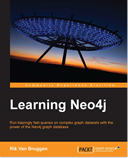

```
Roberto Nogueira  BSd EE, MSd CE
Solution Integrator Experienced - Certified by Ericsson
```

# Learning Neo4j



## Table of Contents

```
Table of Contents

[x] 1: GRAPHS AND GRAPH THEORY – AN INTRODUCTION
[x] 2: GRAPH DATABASES – OVERVIEW
[x] 3: GETTING STARTED WITH NEO4J
[x] 4: MODELING DATA FOR NEO4J
[x] 5: IMPORTING DATA INTO NEO4J
[ ] 6: USE CASE EXAMPLE – RECOMMENDATIONS
[ ] 7: USE CASE EXAMPLE – IMPACT ANALYSIS AND SIMULATION
[ ] 8: VISUALIZATIONS FOR NEO4J
[ ] 9: OTHER TOOLS RELATED TO NEO4J
```
